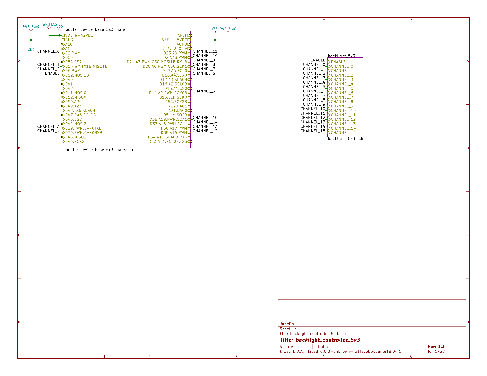
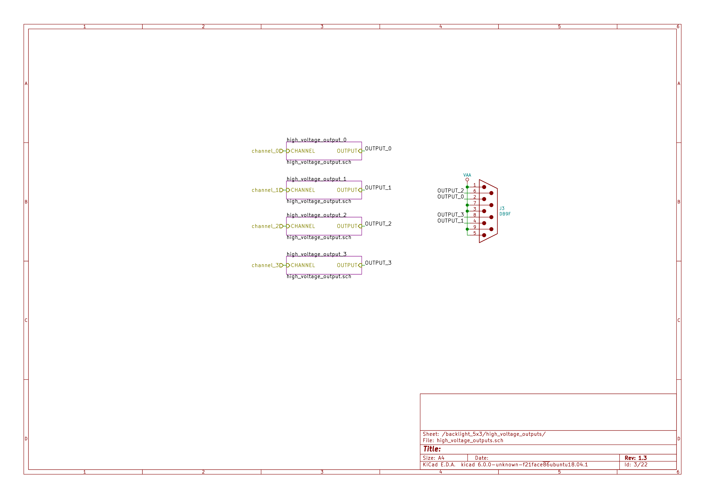
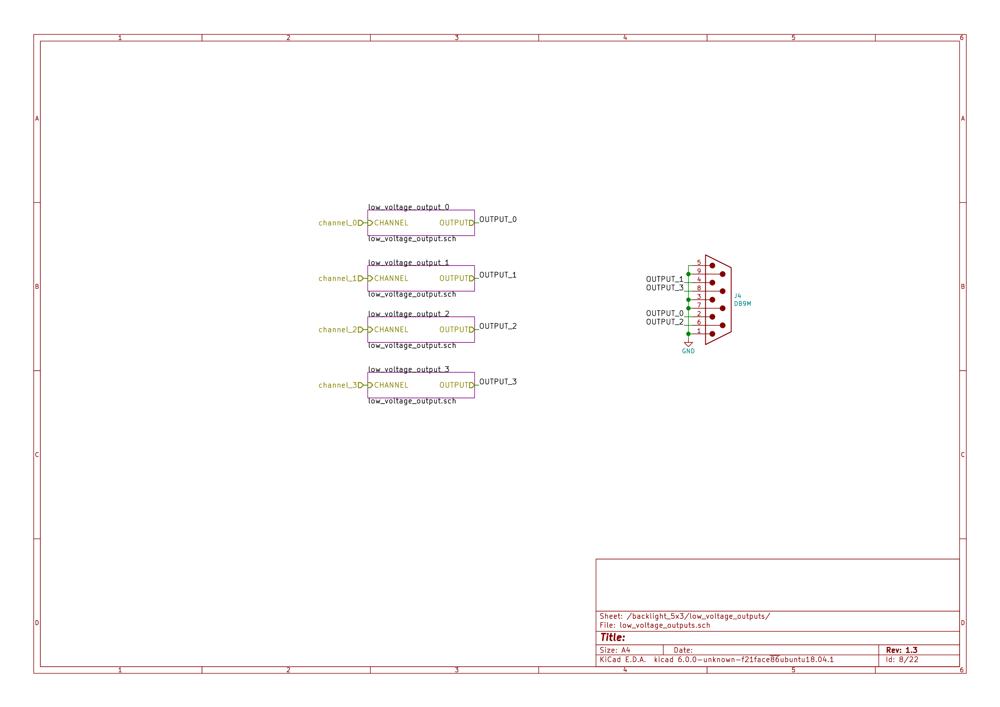
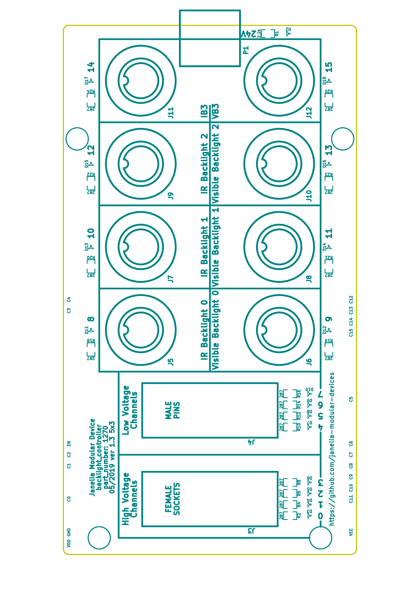

- [Repository Information](#orgf227fca)
  - [Description](#org27d5017)
- [Images](#orgb0dcd7b)
- [Schematic](#org106dd11)
- [Gerbers](#orgf4ca98f)
- [Bill of Materials](#orga130eae)
  - [PCB Parts](#orga063c61)
  - [Supplemental Parts](#org21b68dc)
  - [Vendor Parts Lists](#org7dfc1a6)
- [Supplemental Documentation](#orge1fed7b)
  - [Assembly Instructions](#org6673738)

# Repository Information

-   **Name:** backlight\_controller\_5x3
-   **Version:** 1.2
-   **License:** Open-Source Hardware
-   **URL:** <https://github.com/janelia-kicad/backlight_controller_5x3>
-   **Author:** Peter Polidoro
-   **Email:** peterpolidoro@gmail.com

## Description

This board controls up to four Smart Vision backlights with IR and visible channels plus additional high and low power channel outputs.

# Images

# Schematic

[./schematic/backlight\_controller\_5x3.pdf](./schematic/backlight_controller_5x3.pdf)

# Gerbers

Send gerbers zip file to your favorite PCB manufacturer for fabrication.

[./gerbers/backlight\_controller\_5x3\_v1.2.zip](./gerbers/backlight_controller_5x3_v1.2.zip)

# Bill of Materials

## PCB Parts

| Item | Reference(s)                                            | Quantity | PartNumber         | Vendor  | Description                                                               |
|---- |------------------------------------------------------- |-------- |------------------ |------- |------------------------------------------------------------------------- |
| 1    | C1 C2 C3 C4 C5 C6                                       | 6        | 399-13229-1-ND     | digikey | CAP CER 0.1UF 50V 10% X7R 1210                                            |
| 2    | D1                                                      | 1        | 568-11697-1-ND     | digikey | DIODE SCHOTTKY 45V 10A CFP15                                              |
| 3    | HPS1 HPS2 HPS3 HPS4                                     | 4        | BTS3256DAUMA1CT-ND | digikey | IC SWITCH SMART LOWSIDE TO252-5                                           |
| 4    | J1                                                      | 1        | 1195-4005-1-ND     | digikey | CONN D-SUB RCPT 9POS SMD SOLDER                                           |
| 5    | J10 J3 J4 J5 J6 J7 J8 J9                                | 8        | 277-10282-1-ND     | digikey | CONN FMALE INSERT 5POS SOLDER                                             |
| 6    | J2                                                      | 1        | 1195-4006-1-ND     | digikey | CONN D-SUB PLUG 9POS SMD SOLDER                                           |
| 7    | L1                                                      | 1        | 350-1723-ND        | digikey | LED 2MM 24V VERTICAL RED PC MNT                                           |
| 8    | L10 L11 L12 L13 L14 L15 L16 L17 L2 L3 L4 L5 L6 L7 L8 L9 | 16       | 350-1726-ND        | digikey | LED 2MM 5V VERTICAL GREEN PC MNT                                          |
| 9    | MDB1                                                    | 2        | S1011E-25-ND       | digikey | 25 Positions Header Breakaway Connector 0.1in                             |
| 10   | P1                                                      | 1        | WM1353-ND          | digikey | CONN HEADER 6POS 4.2MM R/A TIN                                            |
| 11   | R1 R2 R3 R4                                             | 4        | P5.90KAACT-ND      | digikey | RES SMD 5.9k OHM 1% 1/2W 1210                                             |
| 12   | R5 R6 R7 R8                                             | 4        | P75.0CCT-ND        | digikey | RES SMD 75 OHM 1% 1/8W 0805                                               |
| 13   | U1 U2                                                   | 2        | 296-14668-1-ND     | digikey | Buffer Non-Inverting 1 Element 8 Bit per Element Push-Pull Output 20-SOIC |
| 14   | U10 U3 U4 U5 U6 U7 U8 U9                                | 8        | NUD3124LT1GOSCT-ND | digikey | IC INDCT LOAD DRVR AUTO SOT23                                             |

## Supplemental Parts

| Item | Quantity | PartNumber   | Vendor  | Description                    |
|---- |-------- |------------ |------- |------------------------------ |
| 1    | 1        | 1866-2122-ND | digikey | AC/DC DESKTOP ADAPTER 24V 280W |
| 2    | 1        | 1866-5006-ND | digikey | CORD IEC 320-C13 6FT BLACK     |
| 3    | 8        | 277-10308-ND | digikey | CONN INSERT SHELL PRESS FIT    |

## Vendor Parts Lists

[./bom/digikey\_parts.csv](./bom/digikey_parts.csv)

[./bom/supplemental\_digikey\_parts.csv](./bom/supplemental_digikey_parts.csv)

# Supplemental Documentation

## Assembly Instructions

-   Solder surface mount and through hole components onto the pcb.
