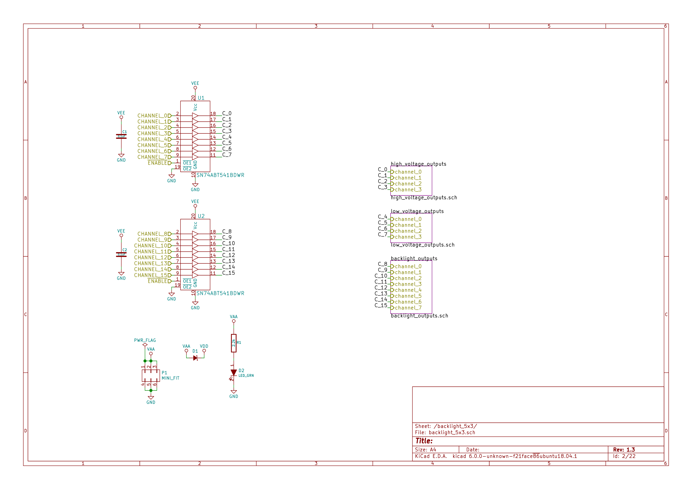
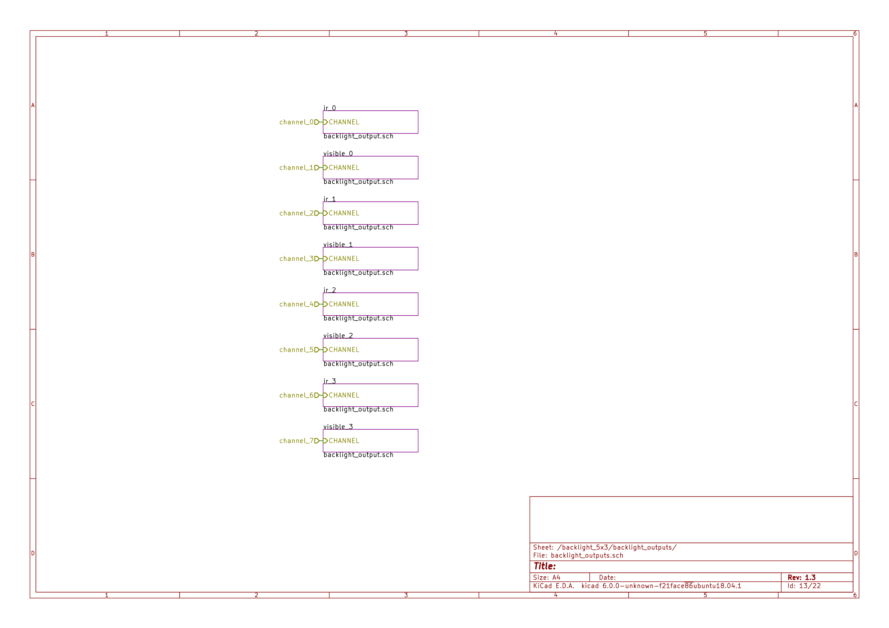
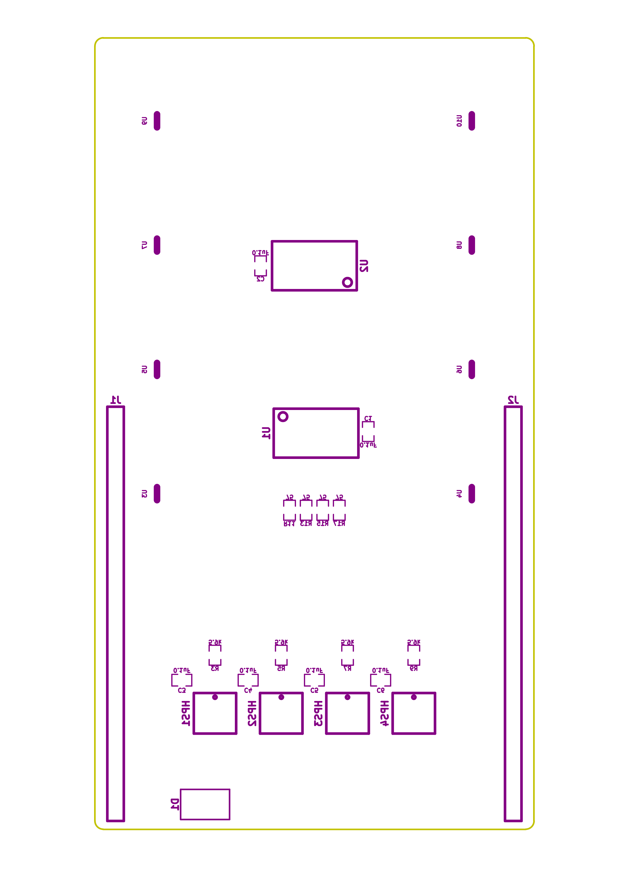

- [Repository Information](#orge3a2ecc)
  - [Description](#org1a124a6)
- [Images](#orgde4a8eb)
- [Schematic](#org565d04b)
- [Gerbers](#orgdefb019)
- [Bill of Materials](#orgbfc12b0)
  - [PCB Parts](#org35e0f28)
  - [Supplemental Parts](#orgb5c14fe)
  - [Vendor Parts Lists](#org5ae73cf)
- [Supplemental Documentation](#orgd3afd80)
  - [Assembly Instructions](#orgc67ada5)
- [Manufacturing Archive](#org51454f0)

# Repository Information

-   **Name:** backlight\_controller\_5x3
-   **Version:** 1.3
-   **License:** Open-Source Hardware
-   **URL:** <https://github.com/janelia-kicad/backlight_controller_5x3>
-   **Author:** Peter Polidoro
-   **Email:** peter@polidoro.io

## Description

This board controls up to four Smart Vision backlights with IR and visible channels plus additional high and low power channel outputs.

# Images

# Schematic

[./schematic/backlight\_controller\_5x3.pdf](./schematic/backlight_controller_5x3.pdf)

# Gerbers

# Bill of Materials

## PCB Parts

| Item | Reference(s)                                                | Quantity | Manufacturer Part Number | Description                                                       |
|---- |----------------------------------------------------------- |-------- |------------------------ |----------------------------------------------------------------- |
| 1    | C1 C2 C3 C4 C5 C6                                           | 6        | C0805T104K5RAL7800       | CAP CER 0.1UF 50V X7R                                             |
| 2    | D1                                                          | 1        | PMEG045V100EPDZ          | DIODE SCHOTTKY 45V 10A                                            |
| 3    | D10 D11 D12 D13 D14 D15 D16 D17 D18 D2 D3 D4 D5 D6 D7 D8 D9 | 17       | LTST-C170GKT             | LED GREEN CLEAR SMD                                               |
| 4    | HPS1 HPS2 HPS3 HPS4                                         | 4        | BTS3256DAUMA1            | IC SWITCH SMART LOWSIDE                                           |
| 5    | J1 J2                                                       | 2        | PBC25SAAN                | CONN HEADER VERT 25POS 2.54MM                                     |
| 6    | J10 J11 J12 J5 J6 J7 J8 J9                                  | 8        | 1411976                  | CONN FMALE INSERT 5POS SOLDER                                     |
| 7    | J3                                                          | 1        | 09551156612741           | CONN D-SUB RCPT 9POS SMD SOLDER                                   |
| 8    | J4                                                          | 1        | 09551296812741           | CONN D-SUB PLUG 9POS SMD SOLDER                                   |
| 9    | P1                                                          | 1        | 0039301060               | CONN HEADER 6POS 4.2MM R/A TIN                                    |
| 10   | R1                                                          | 1        | ERJ-6ENF2201V            | RES SMD 2.2K OHM 1% 1/8W                                          |
| 11   | R10 R12 R14 R16 R18 R19 R2 R20 R21 R22 R23 R24 R25 R4 R6 R8 | 16       | ERJ-6ENF2870V            | RES SMD 287 OHM 1% 1/8W                                           |
| 12   | R11 R13 R15 R17                                             | 4        | ERJ-6ENF75R0V            | RES SMD 75 OHM 1% 1/8W                                            |
| 13   | R3 R5 R7 R9                                                 | 4        | ERJ-6ENF5901V            | RES SMD 5.9K OHM 1% 1/8W                                          |
| 14   | U1 U2                                                       | 2        | SN74ABT541BDWR           | Buffer Non-Inverting 1 Element 8 Bit per Element Push-Pull Output |
| 15   | U10 U3 U4 U5 U6 U7 U8 U9                                    | 8        | NUD3124LT1G              | IC INDCT LOAD DRVR AUTO                                           |

## Supplemental Parts

| Item | Quantity | Manufacturer Part Number   | Description                    |
|---- |-------- |-------------------------- |------------------------------ |
| 1    | 1        | GST280A24-C6P              | AC/DC DESKTOP ADAPTER 24V 280W |
| 2    | 1        | CORD IEC 320-C13 6FT BLACK | CORD IEC 320-C13 6FT BLACK     |

## Vendor Parts Lists

[./bom/Digi-Key\_parts.csv](./bom/Digi-Key_parts.csv)

[./bom/supplemental\_Digi-Key\_parts.csv](./bom/supplemental_Digi-Key_parts.csv)

# Supplemental Documentation

## Assembly Instructions

-   Solder surface mount and through hole components onto the pcb.

# Manufacturing Archive

Send manufacturing zip file to your favorite PCB manufacturer for fabrication.

[./manufacturing/backlight\_controller\_5x3\_v1.3.zip](./manufacturing/backlight_controller_5x3_v1.3.zip)
